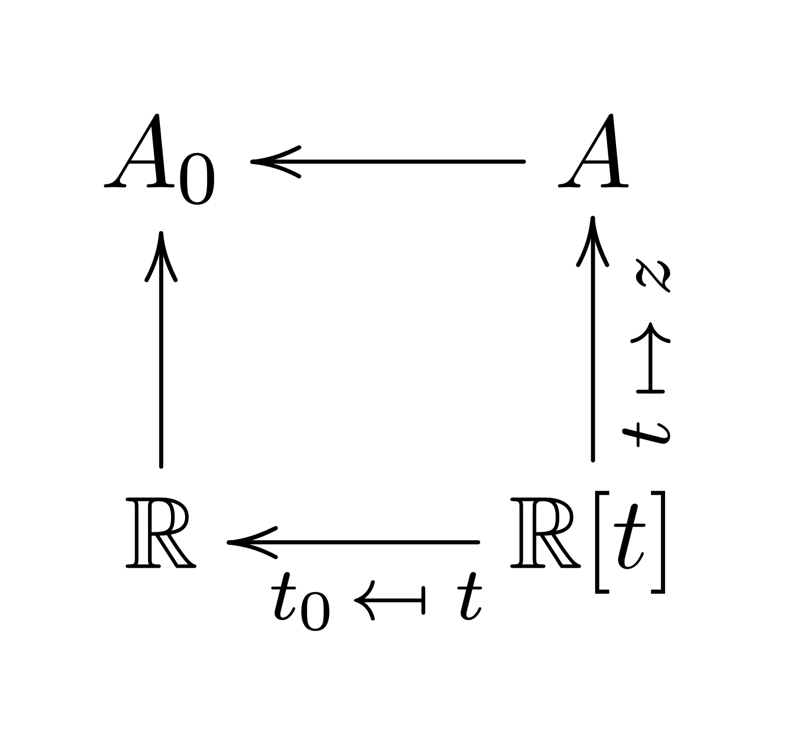

# monad-deform

## Deformations of monads and monad algebras

### Deformations of rings and their modules

$$A\ \ :=\ \ \mathbf{R}[x, y, z]\ \big/\ (x^2+y^2-z)$$

[...]

$$\mathbf{R}[t]\ \longrightarrow\ A\ \ \ \ \ \ \text{taking}\ \ \ \ \ \ t\ \mapsto\ z.$$

If we evaluate $t$ at a particular choice of value $t_0\in\mathbf{R}$, then as a consequence we project the whole algebra $A$ down to a smaller algerba

$$A_0\ \ =\ \ \mathbf{R}[x, y]\ \big/\ (x^2+y^2-t_0).$$

We think of $A$ as a *family of algebras* varying along the parameter $t:=z$. We often interpret this family as *deformation* of the particular algebra $A_0$ that occurs when $t=t_0$.

Note that what we've really described here is the exitence of a commutative diagram:

  

Note that this is a very different thing than deforming a module of a given ring. Suppose that we have some ring that's not necessarily an $\mathbf{R}$-algebra. Let's call this ring $R$. We can also consider *deformations of* $R$-*modules* in which the ring $R$ is fixed and does not deform.

[...]

### Directions of arrows
We get a second interpretation of this situation with the rings $A$ and $A_0$ if we reverse every arrow.

To see this, note that this $\mathbf{R}$-algebra

$$A=\mathbf{R}[x,y,z]\big/(x^2+y^2-z)$$

that we introduced is an algebra of functions defined on the cone in $\mathbf{R}^3$ given by the equation

$$x^2+y^2-z\ =\ 0.$$

We denote this cone "$V(x^2+y^2-z)$." It is the *algebraic variety* cut out by the equaiton determined by vanishing of the polynomial $x^2+y^2-z$. Likewise, our $\mathbf{R}$-algebra $\mathbf{R}[t]$ is the algebra of polynomial functions on the real line $\mathbf{R}$. The standard notation for this latter variety is $\mathbf{A}^{1}_{\mathbf{R}}$.

The morphism of $\mathbf{R}$-algebras

$$\mathbf{R}[t]\longrightarrow A$$

that we used is just the *pullback map* $\varphi^\ast f=f\circ\varphi$ for functions on $\mathbf{A}^{1}_{\mathbf{R}}$, pulled back along the map 

$$\varphi:\ \ V(x^2+y^2-z)\ \longrightarrow\ \mathbf{A}^1_{\mathbf{R}}$$

taking $(x,y,z)\mapsto z$.

[Draw the reverse diagram with all arrows reversed...]

[Draw the picture of fibers of the deforming cone...]

### Singluarities in deformations

### Rings as monads