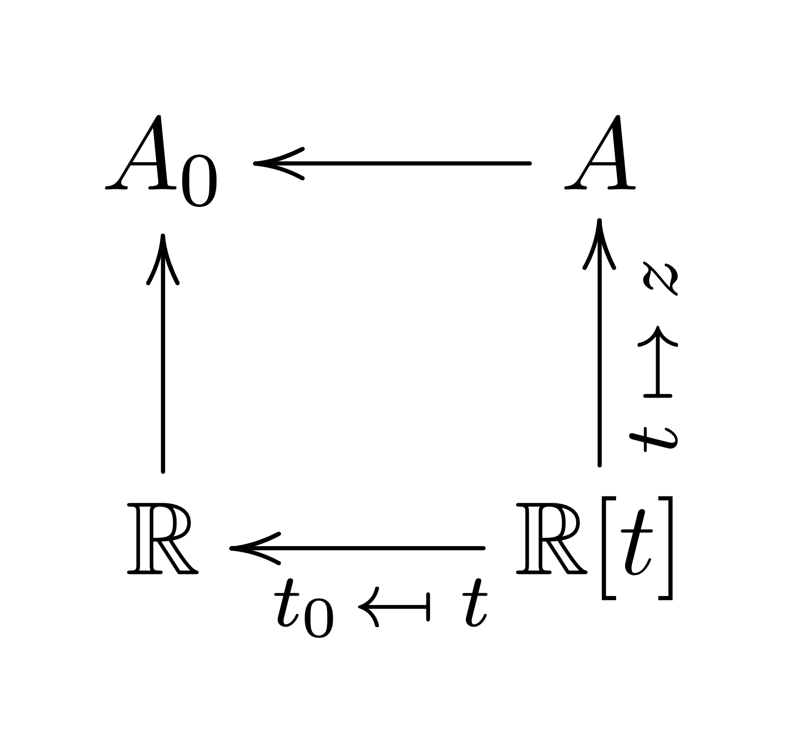
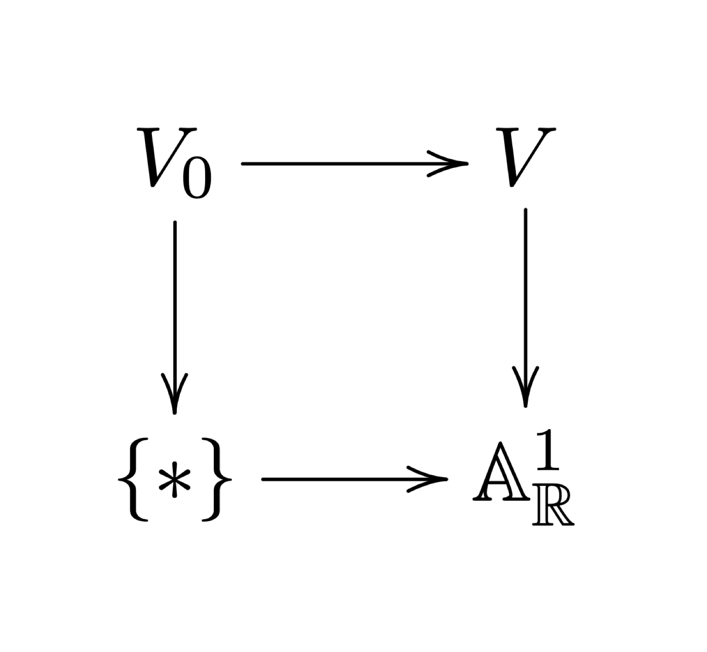
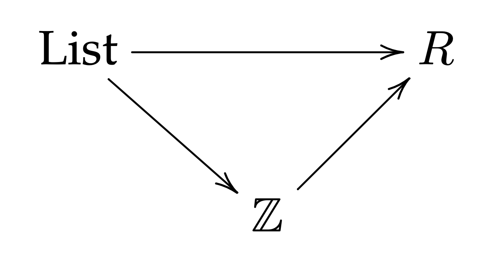
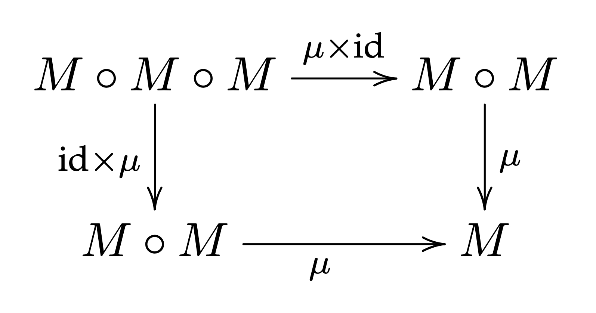

# monad-deform

## Deformations of monads and monad algebras

### Deformations of rings and their modules

$$A\ \ :=\ \ \mathbb{R}[x, y, z]\ \big/\ (x^2+y^2-z^2)$$

[...]

$$\mathbb{R}[t]\ \longrightarrow\ A\ \ \ \ \ \ \text{taking}\ \ \ \ \ \ t\ \mapsto\ z.$$

If we evaluate $t$ at a particular choice of value $t_0\in\mathbb{R}$, then as a consequence we project the whole algebra $A$ down to a smaller algerba

$$A_0\ \ =\ \ \mathbb{R}[x, y]\ \big/\ (x^2+y^2-t_0).$$

We think of $A$ as a *family of algebras* varying along the parameter $t:=z$. We often interpret this family as *deformation* of the particular algebra $A_0$ that occurs when $t=t_0$.

Note that what we've really described here is the exitence of a commutative diagram:

  

Note that this is a very different thing than deforming a module of a given ring. Suppose that we have some ring that's not necessarily an $\mathbb{R}$-algebra. Let's call this ring $R$. We can also consider *deformations of* $R$-*modules* in which the ring $R$ is fixed and does not deform.

[...]

### Directions of arrows
We get a second interpretation of this situation with the rings $A$ and $A_0$ if we reverse every arrow.

To see this, note that this $\mathbb{R}$-algebra

$$A=\mathbb{R}[x,y,z]\big/(x^2+y^2-z^2)$$

that we introduced is an algebra of functions defined on the double-napped cone in $\mathbb{R}^3$ given by the equation

$$x^2+y^2-z^2\ =\ 0.$$

We denote this cone

$$V(x^2+y^2-z^2),$$

or just $V$ for short. It is the *algebraic variety* cut out by the equaiton determined by vanishing of the polynomial $x^2+y^2-z^2$. Likewise, our $\mathbb{R}$-algebra $\mathbb{R}[t]$ is the algebra of polynomial functions on the real line $\mathbb{R}$. The standard notation for this latter variety is $\mathbb{A}^{1}_{\mathbb{R}}$.

The morphism of $\mathbb{R}$-algebras

$$\mathbb{R}[t]\longrightarrow A$$

that we used is just the *pullback map* $\varphi^\ast f=f\circ\varphi$ for functions on $\mathbb{A}^{1}_{\mathbb{R}}$, pulled back along the map 

$$\varphi:\ \ V(x^2+y^2-z^2)\ \longrightarrow\ \mathbb{A}^1_{\mathbb{R}}$$

taking $(x,\ y,\ z)\mapsto z$.

  

When we think about it this way, it becomes more clear why we call this a *defromation*. We are *deforming* a varietiy within a parametrized family of varieties:

[Draw the picture of fibers of the deforming cone...]

### Singularities in deformations

### Rings as monads

### Morphisms from monads to rings

$$\text{List}\longrightarrow A$$

determined by a system of natural maps

$$\text{List}(S)\ \longrightarrow\ \text{Free}_{A\text{-\textbf{Mod}}}(S)$$

that take

$$[\ ]\ \longmapsto\ 0\ \ \ \ \ \ \ \ \ \text{and}\ \ \ \ \ \ \ \ \ [s_1,\ s_2,\ \dots,\ s_n]\ \ \ \longmapsto\ \ \ s_1+s_2+\cdots + s_n$$

In fact this map is canonical in some sense. [...]

  

[...]

  

[...FIX: The "kernel" of this morphism, meaning the equalizer of $\text{List}\xrightarrow{[x, y]\ \mapsto\ x+y} A$ and the zero morphism, includes lists like
$$[x,\ x]\ \ \ \ \ \ \text{and}\ \ \ \ \ \ [x, y, x]\ \sim\ [x, x, y].$$ 
...FIX...]

#### Observation: Abelian groups are $\text{List}$-algebras.
More specifically, the category $\mathbf{Ab}$ of Abelian groups admits the natural structure of a category of algebras for the monad $\text{List}$. More generally, for any ring $R$, the category $R\text{-\textbf{Mod}}$ of $R$-modules admits the natural structure of a category of $\text{List}$-algebras.

### Deformations of monad algebras

### Deformations of monads

### Ring-weighted lists

## Encoding monadic coherence in loss terms

  

$$\mu\ \ \circ\ \ \text{op}_{0}\big(\ \text{op}_{1}(s_{11},\ \dots,\ s_{1n_{1}}),\ \ \dots\ ,\ \ \text{op}_{m}(s_{m1},\ \dots,\ s_{mn_{m}})\ \big)$$

$$\ \ =\ \ \underset{\text{some new operator op${}_{1}$}}{\underbrace{\text{op}_{0}(\text{op}_{1},\dots,\text{op}_{m})}}(s_{11},\ \dots,\ s_{1n_{1}},\ \dots\ ,\ s_{m1},\ \dots,\ s_{mn_{m}})$$

### Observation: A model layer does not need be closed under monad action in order to satisfy coherence.
All we really need is for the image, under the moand's action, to be an instance of some data structure that we're able to compare to other such data structures, and such that this structure can be passed to forward layers.

### "Neuron"-local monadic coherence

## Implementation Roadmap

### Prototype project: [...]

### Prototype project: [...]